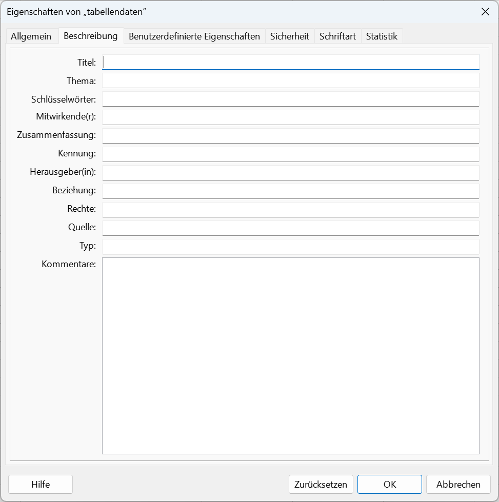
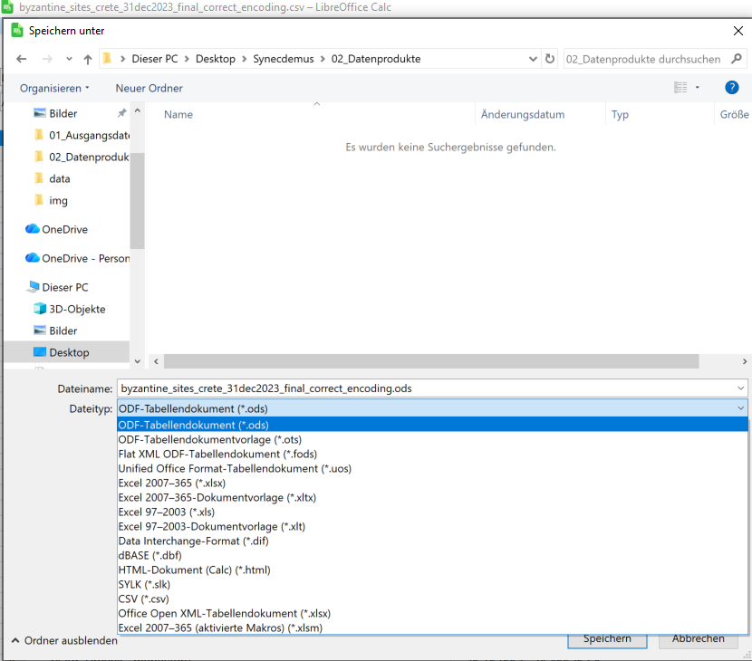
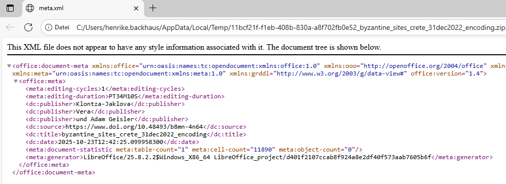
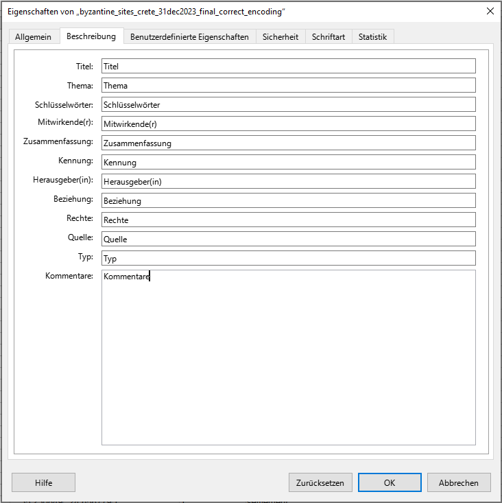

## Praktische Bezüge

Sie wollen ein Tabellendokument mit Metadaten versehen, damit Informationen, wie bspw. Autor\:innen auch für andere Forschende nachvollziehbar sind. Die übliche Vogehensweise, Metadaten innerhalb der Tabellenblätter selbst zu speichern, wollen Sie nicht anwenden, da es sich z.B. um statistische Daten handelt, die "sauber" abgelegt sein müssen. Auch ein README wollen Sie ungern verfassen, da Sie wissen, dass separat abgelegte Informationen oftmals verloren gehen und das wollen Sie vermeiden.

### Voraussetzungen {.kolophon .unnumbered .unlisted}

Für das Verständnis dieser Übung werden vorausgesetzt:

Software:

- ein leistungsstarker Text-Editor (empfohlen: [Notepad++](https://notepad-plus-plus.org/downloads/ "Link zum Download von Notepad++"))
- LibreOffice Calc
  - Sollte LibreOffice noch nicht auf Ihrem Rechner installiert sein, [holen Sie das nach](https://de.libreoffice.org/download/download/ "Link zur Download Seite von Libre Office").

Kompetenzen:

- Kenntnis der verschiedenen Arten von Metadaten
- Verständnis von Metadatenschemata
- XML-Grundkenntnisse oder grundlegendes Verständnis von Markup-Sprachen.

## Datengrundlage

Ausgangspunkt der Übung ist ein Datensatz, den Vera Klontza-Jaklova und Adam Geisler Ende 2022 über die Datenplattform Pandora publiziert haben:

> [@klontza-jaklova2023] Klontza-Jaklova, Vera, und Adam Geisler. „SYNECDEMUS NOVUS“. Csv-file. Pandora, 12. Januar 2023. <https://www.doi.org/10.48493/b8mn-4n64>.

Wir arbeiten mit einem **Derivat** der `.xls`-Datei, das Sie im Ordner `data` finden können.

## Vorbereitung

Bevor wir einen Blick in die Daten selbst werfen, bereiten wir eine geeignete Verzeichnis-Struktur für die Übung vor. Für eine übersichtliche Aufgabenstellung, wie in dieser Übung, bietet sich folgendes Schema an:

-   `01_Ausgangsdaten`: für alle heruntergeladenen Daten in ihrem Originalzustand inkl. Dokumentation der Datenquelle etc. in einer .md-Datei mit Links und Bemerkungen.
-   `02_Datenprodukte`: für alle aus den Ausgangsdaten abgeleiteten Datensätze, die für die Auswertung benötigt werden. Anzustreben ist die Verwendung nicht-proprietärer, offener und für eine Archivierung geeigneter Datenformate.

Achten Sie darauf, dass der Verzeichnispfad keine Sonder- oder Leerzeichen enthält.

Laden Sie anschließend den [vorbereiteten Datensatz](data/byzantine_sites_crete_31dec2022_final_correct_encoding.csv) in das Verzeichnis `01_Ausgangsdaten` herunter:

## Aufgabenstellungen

Wir wollen den Datensatz nun mit Metadaten versehen. Navigieren Sie dazu ins [Repositorium Synecdemus Novus](https://pandoradata.earth/dataset/synecdemus-novus), aus dem der Datensatz ursprünglich stammt, und sehen Sie sich um. Welche Metadaten können Sie hier finden? 

::::: columns
::: {.column width="60%"}
Öffnen Sie den Datensatz mit LibreCalc und navigieren Sie zu `Datei > Eigenschaften`. Sie sehen nun ein Fenster, in das Sie vorgegebene Metadaten zur Datei eintragen können, bspw.:

- Titel
- Mitwirkende
- Rechte
- Quelle
- etc.

:::

::: {.column width="40%"}



:::
:::::

Tragen Sie folgende Metadaten ein:

```markdown
- Titel: byzantine_sites_crete_31dec2022_final_correct_encoding.csv
- Herausgeber(in): Klontza-Jaklova, Vera, und Adam Geisler
- Quelle: https://www.doi.org/10.48493/b8mn-4n64

```

Speichern Sie die Datei als `.ods`-Datei im Ordner `02_Datenprodukte` ab. 



Schließen Sie LibreCalc. Wenn Sie jetzt die `.ods`-Datei wieder mit LibreCalc öffnen, finden Sie die eingetragenen Metadaten weiterhin in den Eigenschaften.

::: callout-important
Sollten die Dateiendungen in Ihrem Explorer nicht angezeigt werden, müssen Sie unter "Ansicht" ein Häkchen bei "Dateinamenerweiterungen" setzen. 
::: 

Wir wenden jetzt einen Trick an, um die soeben von uns hinterlegten Metadaten genauer zu sichten. Wie bereits oben beschrieben, handelt es sich bei `.ods` um ein `.zip`-Archiv mit XML-Dateien. Benennen Sie die `.ods`-Dateiendung einfach in `.zip` um, entpacken und öffnen Sie den Ordner.

::: {layout-ncol=2}
Sie finden nun eine Datei "meta.xml" - doppelklicken Sie, um sie zu öffnen (ggf. müssen Sie einen Browser dafür auswählen). Sie sehen nun den Code, der zu den Metadaten hinterlegt ist.


:::

:::panel-tabset


### Aufgabe 1

Wie sind die Metadaten im XML strukturiert? Was müssen wir bei der Eingabe also beachten?

Auf welches Metadatenschema beziehen sich die Angaben?

### Lösung

Ab Zeile 6 können wir sehen, dass es vermeintlich mehrere "publisher" des Datensatzes gibt. Dies ergibt sich daraus, dass wir im Eigenschaften-Feld in LibreOffice Calc Kommata genutzt haben, um Nach- und Vornamen von Vera Klontza-Jaklova und Adam Geisler voneinander zu trennen. Die Translation aus LibreOffice Calc versteht die Kommata als Angabe jeweils neuer "publisher".

Das "\<dc:publisher\>" verweist auf den [Dublin Core](https://www.dublincore.org/), der hier als Metadatenschema hinterlegt ist. Der Dublin Core ist eines der gängigsten Metadatenschemata zur Beschreibung von elektronischen Ressourcen. 
:::

Schließen Sie den Browser und öffnen Sie die Datei "meta.xml" mit *Notepad++* (ggf. müssen Sie in der Ansicht einen automatischen Zeilenumbruch aktivieren).

:::panel-tabset

### Aufgabe 

Bereinigen Sie die Angaben zu den Herausgeber\:innen.

### Schritt 1

Korrigieren Sie die Angaben, indem Sie den Vor- und Nachnamen von Vera Klontza-Jaklova zusammenführen.

```xml {.code-overflow-wrap}
<?xml version="1.0" encoding="UTF-8"?>
<office:document-meta xmlns:office="urn:oasis:names:tc:opendocument:xmlns:office:1.0" xmlns:ooo="http://openoffice.org/2004/office" xmlns:xlink="http://www.w3.org/1999/xlink" xmlns:dc="http://purl.org/dc/elements/1.1/" xmlns:meta="urn:oasis:names:tc:opendocument:xmlns:meta:1.0" xmlns:grddl="http://www.w3.org/2003/g/data-view#" office:version="1.4"><office:meta><meta:editing-cycles>1</meta:editing-cycles><meta:editing-duration>PT3M9S</meta:editing-duration><dc:publisher>Vera Klontza-Jaklova</dc:publisher><dc:publisher>Adam Geisler</dc:publisher><dc:source>https://www.doi.org/10.48493/b8mn-4n64</dc:source><dc:title>byzantine_sites_crete_31dec2022_final_correct_encoding.csv</dc:title><dc:date>2025-10-28T10:17:32.651077800</dc:date><meta:document-statistic meta:table-count="1" meta:cell-count="11890" meta:object-count="0"/><meta:generator>LibreOffice/25.2.6.2$Windows_X86_64 LibreOffice_project/729c5bfe710f5eb71ed3bbde9e06a6065e9c6c5d</meta:generator></office:meta></office:document-meta>
```

### Schritt 2

Speichern Sie die Datei "meta.xml" ab und schließen Sie sie. Erstellen Sie aus den Dateien in Ihrem extrahierten Ordner ein neues `.zip`-Archiv (alle Dateien markieren --> Rechtsklick *Senden an*...). Benennen Sie dieses wieder in eine `.ods`-Datei um. Wenn Sie diese nun öffnen, finden Sie in den Eigenschaften die korrigierten Metadaten zu den Herausgeber\:innen.

:::

## Ergebnisse

Sie haben nun Metadaten zu einem in `.csv` gespeicherten Datensatz angelegt und im XML manipuliert. Der Vorteil ist: Auf diese Weise können Sie Metadaten zu Tabellendaten ablegen, die innerhalb der Datei selbst gespeichert sind.
Der Nachteil ist: Sie können lediglich Metadatentypen ablegen, die von `.ods` erlaubt werden. Sollten Sie weitere oder umfassendere Metadaten anlegen wollen, müssen Sie auf andere Wege zurück greifen.

:::panel-tabset

## Transferaufgaben

### Transferaufgabe 1

Vergleichen Sie die im Repositorium der Ursprungsdatei hinterlegten Metadaten mit den möglichen Angaben im [Dublin Core](https://www.dublincore.org/resources/userguide/creating_metadata/#Titles)

Finden Sie heraus, welche Metadatenarten in Dublin Core hinter welchem Metadatum im `.ods`hinterlegt sind.

Hinterlegen Sie auf oben beschriebene Weise weitere Metadaten zu Ihrer Tabelle.

### Lösungsvorschlag

Tragen Sie in der `.ods`-Datei in jedem Eigenschaftenfeld die jeweilige Bezeichnung des Eigenschaftenfelds ein und rufen Sie - wie oben beschrieben - die Datei "meta.xml" auf. Sie sehen nun, wie die jeweiligen Typen aus dem Dublin Core ins Deutsche übersetzt wurden und können Ihre Metadaten entsprechend eintragen. 

:::

Schließen Sie den Browser und öffnen Sie die Datei "meta.xml" mit *Notepad++* (ggf. müssen Sie in der Ansicht einen automatischen Zeilenumbruch aktivieren).

:::panel-tabset

### Transferaufgabe 2

Fügen Sie über die Datei "meta.xml" weitere relevante Metadaten hinzu. Wie werden diese nach Kompilation der Dateien zu einer `.ods`-Datei wohl dargestellt?

### Lösung

Da in der grafischen Oberfläche von LibreOffice Calc lediglich vorgegebene Eigenschaften abgebildert werden, werden Ihre zusätzlichen Metadaten nicht abgerufen. Allerdings bleiben Sie in der `.xml`-Datei als Metadaten erhalten und sind so - mit entsprechenden Hinweisen (z.B. in ReadMes) für die Nachnutzenden innerhalb der Datei auffindbar. 

:::

## Nachnutzen {.appendix .unnumbered}

Alle sind herzlich eingeladen, diesen Baustein und die zugehörige Copyleft-Lizenz zu nutzen, um ihr Wissen und Expertise in die Verbesserung und Aktualisierung einzubringen.

Unser Wunsch ist ein lebendiges, stetig aktualisiertes Dokument, das sich durch die Beiträge vieler verändert - im Einklang mit eines sich wandelnden Umfelds. Wir freuen uns im Falle einer Überarbeitung über eine kurze Notiz – das ist aber selbstverständlich keine Pflicht.

<!-- Verweise auf Website und Repository werden in _oer_metadata.yml global festgelegt. Wenn die OER nicht in einem git-Repository gehostet oder online bereitgestellt werden, können die folgenden zwei Zeilen gelöscht werden. -->

:link: [Dieser Baustein als Website]() 

:link: [Quarto-Quellcode dieses Bausteins]()

-----

Diese Übung nutzt ein [FAIR-OER-Übungs-Template von NFDI4Objects](https://nfdi4objects.github.io/oer-template-skript/).

## Disclaimer: Einsatz von LLM {.appendix .unnumbered}

<!-- Optionale Angaben zum Einsatz von LLM bei der Erstellung oder Überarbeitung der Übung -->

<!-- An dieser Stelle werden von Quarto automatisch generierte Abschnitte angehängt:

Bibliographie:
Erstellt aus den in der qmd-Datei mit [@bibtex-Schlüssel] referenzierten Einträgen aus der Datei bibliographie.bib.
Im Text nicht referenzierte Einträge aus der bibliographie.bib werden nicht zitiert.
Der Zitierstil wird in der _oer_metadata.yml mit dem Schlüssel 'csl:' festgelegt. Im Verzeichnis /assets/csl/ sind gängige Zitierstile als csl-Datei vorhanden. Weitere sind hier zu finden: https://www.zotero.org/styles

Lizenz:
Angabe wird übernommen aus Schlüssel 'license:' in _oer_metadata.yml

Urheber:innen
Angabe wird übernommen aus der _oer_metadata.yml Schlüssel 'copyright:'

Zitiervorschläge
Mit BibTeX zitieren:
Automatisch von Quarto aus den Metadaten insb. aus dem Schlüssel 'citation:' in der _oer_metadata.yml generiertes bibtex-Zitat.

Bitte zitieren Sie diesen OER-Baustein als:
Angabe generiert aus:
  _autor_innen.yml
  Schlüssel 'title:' in der qmd-Datei
  Schlüssel 'issued' in der _oer_metadata.yml
  Schlüssel 'doi:' in der _oer_metadata.yml / Wenn keine doi gesetzt wird der Titel mit dem Wert aus 'site-url:' in _oer_metadata.yml verlinkt.
-->